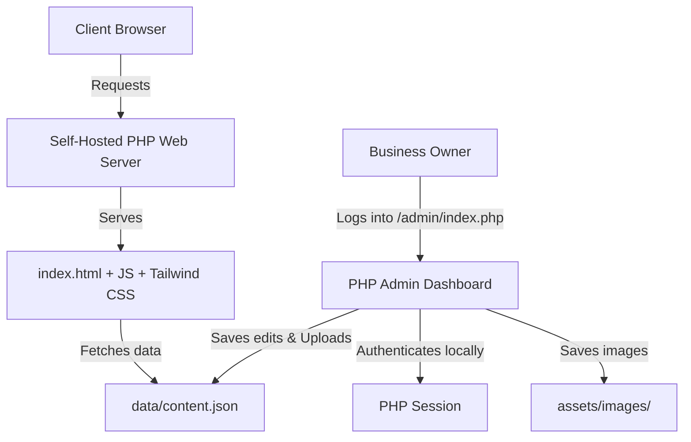

# Product Requirement Document (PRD) & Design Spec
## Oncall & home service message Website

**Date:** 2026-08-20  
**Status:** Approved  
**Language:** English (Client-facing), Indonesian (Internal/Admin)  
**Tech Stack:** HTML5, Tailwind CSS, Vanilla JS, PHP 7.4+, cPanel / Shared Hosting

---

## 1. Executive Summary
This project aims to build a high-performance, secure, and visually appealing business profile website for a home service massage (pijat panggilan) business in Bali. The website targets foreign tourists and expats. The design utilizes a tropical green theme promoting relaxation and wellness. All client-facing copy is in English. 

To ensure ease of management for a non-technical owner on a self-hosted platform (e.g. cPanel, Hostinger), the site integrates a custom **PHP Admin Dashboard** (`admin/index.php`) which allows updating general business settings, services, prices, areas, and FAQs without touching code. The dashboard supports image uploading directly to the server (`assets/images/`) and reads/writes to `data/content.json`.

---

## 2. Target Audience
*   **Demographics:** Foreign tourists, holidaymakers, and expatriates living in or visiting Bali.
*   **Needs:** Easy, reliable, and premium on-call spa and massage services delivered directly to their villa, hotel, or residence.
*   **Key Friction Points to Solve:** Trust (professionalism, certified therapists, hygiene), clear pricing, easy navigation, and seamless booking via WhatsApp.

---

## 3. UI/UX & Design Requirements
*   **Mobile-First Design:** Optimized for smartphones (responsive layout), as most tourists browse on mobile.
*   **Color Palette (Green Theme):**
    *   **Primary Color:** Rich tropical greens (representing nature, serenity, wellness).
    *   **Secondary/Accent Colors:** Soft gold, warm beige, and clean white to convey a premium, clean, and luxury spa vibe.
*   **Typography:** Elegant serif fonts for headings (spa vibe) and clean sans-serif fonts for readable body copy.
*   **Key Sections on Homepage:**
    1.  **Header:** Logo and quick navigation links.
    2.  **Hero Banner:** Eye-catching headline, background image of a relaxing tropical massage setting, and a "Book Now" CTA.
    3.  **Why Choose Us:** Professional/certified therapists, premium natural oils, high hygiene standards, and zero extra transport fees.
    4.  **Massage Menu (Services list):** Clear cards with images, descriptions, durations, pricing, and direct WhatsApp booking CTAs.
    5.  **How It Works:** 3-step booking explanation.
    6.  **Service Area Coverage:** Clear list of serviced regions in Bali + Google Maps embed.
    7.  **FAQ Section:** Collapsible accordion for common client inquiries.
    8.  **Footer:** Direct contact details, operating hours, and social media links.

---

## 4. Service Area Coverage
The service coverage areas displayed on the website include:
*   Pecatu, Uluwatu, Nusa Dua
*   Kuta, Seminyak, Canggu (including Pererenan)
*   Tanah Lot, Tabanan
*   Gianyar, Ubud

---

## 5. Functional Requirements
### A. Homepage & Dynamic Service Catalog (via JSON)
*   The page must dynamically load content (services, prices, images, and contact info) from `data/content.json` using client-side JavaScript.
*   The database consists of a local JSON structure, preventing database server overhead and enhancing security.

### B. PHP Admin Dashboard
*   Located at `/admin/` (or `/admin/index.php`).
*   Requires a secure single-password session login (`session_start()`). Password hashing is used for storage.
*   Allows full CRUD (Create, Read, Update, Delete) on Massage Menu, FAQs, and Service Areas.
*   Supports secure image uploads to `assets/images/` with mime-type checking to prevent malicious scripts.
*   Directly updates `data/content.json` upon saving changes.

### C. WhatsApp Booking Integration
*   Every massage service card features a "Book via WhatsApp" button.
*   When clicked, it opens WhatsApp with a pre-filled template message:
    ```text
    Hi, I would like to book a [Service Name] ([Duration] mins). Here are my details:
    - Date & Time: 
    - Address (Hotel/Villa/Home): 
    - Number of People: 
    Please confirm my booking. Thank you!
    ```

### D. Google Maps Integration
*   An embedded Google Map showing the coverage zones of the service areas to help tourists visually locate their hotels/villas relative to the service coverage.

### E. SEO & Ads Optimization
*   Proper use of semantic HTML (`<h1>`, `<h2>`, `<section>`).
*   Meta title, description, and OpenGraph tags targeting keywords like "massage home service Bali", "oncall spa Seminyak", "best villa massage Canggu".
*   Optimized image alt tags and fast loading times for Google Ads Quality Score optimization.

---

## 6. Technical Architecture & CMS Structure


### Admin Settings structure (mapped in `data/content.json`)
The admin panel manages:
1.  **General Settings:** Brand Name, Tagline, Description, WhatsApp Phone, Instagram, Operating Hours.
2.  **Massage Menu (List):** Unique ID, Title, Description, Durations & Prices (e.g. 60 Mins - 250k), Image File Path, Featured Flag.
3.  **Areas (List):** String names of coverage areas.
4.  **FAQs (List):** Question, Answer.
